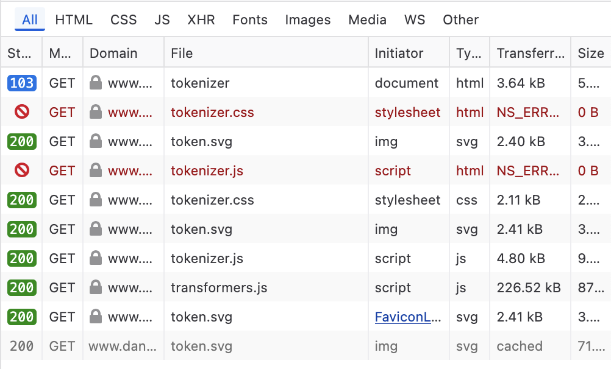

<!-- Generated by claude-code-log v0.10.0 -->


# Claude Transcript - style_guide

## Sessions

- [Session `style_gu`: 📋 **Summary Example** - This style guide demonstrated all major message types: user messages, assistant responses, tool usage (both successful and error cases), system commands, command outputs, long text handling, special character support, and this summary. The transcript viewer properly renders markdown, handles tool interactions, manages text wrapping, and supports full Unicode character sets. All visual elements maintain consistent styling and readability.](#session-style_gu)
- [Session `sample_m`: CSS Details Margin Styling](#session-sample_m)


<a id="session-style_gu"></a>

# 📋 Session `style_gu`: 📋 **Summary Example** - This style guide demonstrated all major message types: user messages, assistant responses, tool usage (both successful and error cases), system commands, command outputs, long text handling, special character support, and this summary. The transcript viewer properly renders markdown, handles tool interactions, manages text wrapping, and supports full Unicode character sets. All visual elements maintain consistent styling and readability.

## 🤷 User: *📝 \*\*User Message Example\*\**

````
📝 **User Message Example**

This is a basic user message with some **markdown formatting**:

- Bullet points work
- `inline code` is supported
- [Links](https://example.com) are preserved

Code blocks are also supported:
```python
def hello_world():
    print("Hello, world!")
    return 42
```
````

### 🤖 Assistant: *🤖 \*\*Assistant Message Example\*\**

> 🤖 **Assistant Message Example**
> 
> This is a basic assistant response. It supports the same markdown formatting:
> 
> ## Headers work too
> 
> ### Subheaders
> 
> > Block quotes look nice
> 
> | Tables | Also | Work | Great |
> |--------|------|------|-------|
> | Cell 1 | Cell 2 | Cell 3 | Cell 4 |
> | Data   | More  | Info  | Values |
> 
> ```javascript
> // Different language syntax highlighting
> function greet(name) {
>     console.log(`Hello, ${name}!`);
>     return true;
> }
> ```
> 
> **Key features:**
> - Full markdown support
> - Syntax highlighting
> - Responsive design
> - Clean typography

### 🤖 Assistant: *🛠️ \*\*Tool Use Example\*\**

> 🛠️ **Tool Use Example**
> 
> Let me create a file to demonstrate tool usage:

#### ✏️ Edit `style_guide_example.py`

```diff
@@ -0,0 +1,36 @@+#!/usr/bin/env python3
+"""
+Style Guide Example File
+
+This file demonstrates how tool usage appears in transcripts.
+"""
+
+import os
+import sys
+from typing import List, Dict, Any
+
+
+class StyleGuideExample:
+    """Example class for the style guide."""
+    
+    def __init__(self, name: str):
+        self.name = name
+        self.items: List[Dict[str, Any]] = []
+    
+    def add_item(self, item: Dict[str, Any]) -> None:
+        """Add an item to the collection."""
+        self.items.append(item)
+        print(f"Added item: {item.get('name', 'Unknown')}")
+    
+    def process_all(self) -> None:
+        """Process all items in the collection."""
+        for i, item in enumerate(self.items):
+            print(f"Processing item {i+1}: {item}")
+
+
+if __name__ == "__main__":
+    example = StyleGuideExample("Demo")
+    example.add_item({"name": "Sample", "value": 42})
+    example.add_item({"name": "Test", "value": 100})
+    example.process_all()
+    print("Style guide example completed!")
```

```
File created successfully at: /tmp/style_guide_example.py
```

### 🤖 Assistant: *⚠️ \*\*Tool Error Example\*\**

> ⚠️ **Tool Error Example**
> 
> Let me demonstrate what happens when a tool encounters an error:

#### 💻 Bash: *This command will fail to demonstrate error handling*

```bash
$ nonexistent_command --invalid-flag
```

```
bash: line 1: nonexistent_command: command not found
Error: Command 'nonexistent_command' not found in PATH
Exit code: 127
```

## 🤷 Command `style-guide-test`

**Args:** `--format json --output /tmp/test.json`

```
This is the command content with JSON data:
{
  "name": "Style Guide Test",
  "version": "1.0.0",
  "description": "Demonstrates command content formatting"
}
```

```
Style Guide Test Results:
✓ Message rendering: PASSED
✓ Markdown processing: PASSED
✓ Tool use formatting: PASSED
✓ Error handling: PASSED
✓ System commands: PASSED
✓ Unicode support: PASSED

Total tests: 6
Passed: 6
Failed: 0

Timestamp: 2025-06-14T10:02:10Z
Status: ALL_TESTS_PASSED

Style guide generation completed successfully! 🎉
```

## 🤷 User: *📏 \*\*Long Text Example\*\**

```
📏 **Long Text Example**

This message demonstrates how long text content is handled by the transcript viewer. The CSS should handle word wrapping automatically, ensuring that even very long messages remain readable and don't break the layout.

Lorem ipsum dolor sit amet, consectetur adipiscing elit, sed do eiusmod tempor incididunt ut labore et dolore magna aliqua. Ut enim ad minim veniam, quis nostrud exercitation ullamco laboris nisi ut aliquip ex ea commodo consequat. Duis aute irure dolor in reprehenderit in voluptate velit esse cillum dolore eu fugiat nulla pariatur. Excepteur sint occaecat cupidatat non proident, sunt in culpa qui officia deserunt mollit anim id est laborum.

Sed ut perspiciatis unde omnis iste natus error sit voluptatem accusantium doloremque laudantium, totam rem aperiam, eaque ipsa quae ab illo inventore veritatis et quasi architecto beatae vitae dicta sunt explicabo. Nemo enim ipsam voluptatem quia voluptas sit aspernatur aut odit aut fugit, sed quia consequuntur magni dolores eos qui ratione voluptatem sequi nesciunt.

The layout should remain clean and readable even with this amount of text content. Line breaks and paragraph spacing should be preserved appropriately.
```

### 🤖 Assistant: *🌍 \*\*Special Characters & Unicode Example…*

> 🌍 **Special Characters & Unicode Example**
> 
> The transcript viewer supports full Unicode:
> 
> **Accented characters:** café, naïve, résumé, piñata
> **Non-Latin scripts:** 中文, العربية, русский, ελληνικά, हिन्दी
> **Mathematical symbols:** ∑∆√π∞≈≠±×÷
> **Currency symbols:** $¢£€¥₹₿
> **Arrows and symbols:** →←↑↓⇒⇐↔️⚡⭐
> **Emojis:** 🎉🚀🎯🔥💡🌟⚙️📝🎨🎭
> 
> **Code with special chars:**
> ```python
> # Unicode in code comments: π ≈ 3.14159
> def calculate_π():
>     return 22 / 7  # Approximation of π
>     
> # String with Unicode
> greeting = "Hello, 世界! 🌍"
> print(f"Mathematical: √16 = {16**0.5}")
> ```
> 
> All characters should render correctly without breaking the layout!

<a id="session-sample_m"></a>

# 📋 Session `sample_m`: CSS Details Margin Styling

## 🤷 User: *Oh, I just found out that this is not supported…*

```
Oh, I just found out that this is not supported by Chrome :(\
\
This is the relevant CSS:\
\
ul#models li span {
  display: ruby-base;
  font-size: 0.7em;
  margin: 0 0.15em;
}
ul#models li code {
  display: ruby-text;
  font-size: 2em;
  letter-spacing: 0.05em;
}
\
Can you please help rewriting this to use proper HTML ruby elements?
```

## 🤷 Command `/model`

```
Set model to opus (claude-opus-4-5-20251101)
```

### 🤖 Assistant: *I'll help you rewrite this to use proper…*

> I'll help you rewrite this to use proper HTML ruby elements, which have better browser support than the CSS `ruby-base` and `ruby-text` display values.
> 
> Let me first examine the current structure to understand how it's being used:

#### System Info

ℹ️ Running PostToolUse:MultiEdit...

## 🤷 User: *Do you think we could set up rewrites for…*



```
Do you think we could set up rewrites for the JS and CSS? This basePath method does the job, but we end up with two failed requests for so it impacts page load times
```

### ❓ Asking questions...

```
Error: No such tool available: AskUserQuestion
```

### 💻 Bash: *Copy tokenizer files to new repo*

```bash
$ cp /Users/dain/workspace/danieldemmel.me-next/public/tokenizer.html /Users/dain/workspace/online-llm-tokenizer/index.html && cp /Users/dain/workspace/danieldemmel.me-next/public/tokenizer.css /Users/dain/workspace/online-llm-tokenizer/tokenizer.css && cp /Users/dain/workspace/danieldemmel.me-next/public/tokenizer.js /Users/dain/workspace/online-llm-tokenizer/tokenizer.js
```

```

```

### BashOutput

**bash_id:** `dce0af`

```
<status>running</status>

<stdout>
> jssoundrecorder@0.1.0 dev /Users/dain/workspace/JSSoundRecorder
> vite


  VITE v5.4.21  ready in 377 ms

  ➜  Local:   http://localhost:5173/
  ➜  Network: use --host to expose
</stdout>

<timestamp>2025-11-18T00:03:27.238Z</timestamp>
```

### ✏️ Edit `tokenizer.js`

```diff
@@ -2,7 +2,7 @@   return (acc +=
     text === '\n'
       ? '<br>'
-      : `<span class="token">${token}</span><code style="background: #${
+      : `<ruby><rb style="background: #${
           COLOURS[index % COLOURS.length]
-        }66">${text.replace(/&/g, '&amp;').replace(/</g, '&lt;').replace(/>/g, '&gt;')}</code>`)
+        }66">${text.replace(/&/g, '&amp;').replace(/</g, '&lt;').replace(/>/g, '&gt;')}</rb><rt class="token">${token}</rt></ruby>`)
 }
```

```
File has not been read yet. Read it first before writing to it.
```

### 📝 Exiting plan mode

✓ Approved

User has approved your plan. You can now start coding. Start with updating your todo list if applicable

### 📂 Glob `package.json`

```
/Users/dain/workspace/danieldemmel.me-next/package.json
```

### 🔎 Grep `ul#models`

```
/Users/dain/workspace/danieldemmel.me-next/public/tokenizer.css-  border-radius: 7px;
/Users/dain/workspace/danieldemmel.me-next/public/tokenizer.css-}
/Users/dain/workspace/danieldemmel.me-next/public/tokenizer.css:ul#models {
/Users/dain/workspace/danieldemmel.me-next/public/tokenizer.css-  word-wrap: break-word;
/Users/dain/workspace/danieldemmel.me-next/public/tokenizer.css-  padding: 0;
/Users/dain/workspace/danieldemmel.me-next/public/tokenizer.css-}
/Users/dain/workspace/danieldemmel.me-next/public/tokenizer.css:ul#models li {
/Users/dain/workspace/danieldemmel.me-next/public/tokenizer.css-  list-style: none;
/Users/dain/workspace/danieldemmel.me-next/public/tokenizer.css-  margin: 2em 0;
/Users/dain/workspace/danieldemmel.me-next/public/tokenizer.css-  border: 1px solid #bbb;
/Users/dain/workspace/danieldemmel.me-next/public/tokenizer.css-  border-radius: 7px;
/Users/dain/workspace/danieldemmel.me-next/public/tokenizer.css-  padding: 0.5em 1em 1em 1em;
/Users/dain/workspace/danieldemmel.me-next/public/tokenizer.css-  box-shadow: 1px 1px 2px 1px rgba(0, 0, 0, 0.2);
/Users/dain/workspace/danieldemmel.me-next/public/tokenizer.css-}
/Users/dain/workspace/danieldemmel.me-next/public/tokenizer.css:ul#models li span {
/Users/dain/workspace/danieldemmel.me-next/public/tokenizer.css-  display: ruby-base;
/Users/dain/workspace/danieldemmel.me-next/public/tokenizer.css-  font-size: 0.7em;
/Users/dain/workspace/danieldemmel.me-next/public/tokenizer.css-  margin: 0 0.15em;
/Users/dain/workspace/danieldemmel.me-next/public/tokenizer.css-}
/Users/dain/workspace/danieldemmel.me-next/public/tokenizer.css:ul#models li code {
/Users/dain/workspace/danieldemmel.me-next/public/tokenizer.css-  display: ruby-text;
/Users/dain/workspace/danieldemmel.me-next/public/tokenizer.css-  font-size: 2em;
/Users/dain/workspace/danieldemmel.me-next/public/tokenizer.css-  letter-spacing: 0.05em;
/Users/dain/workspace/danieldemmel.me-next/public/tokenizer.css-}
```

### KillShell

**shell_id:** `dce0af`

```
{"message":"Successfully killed shell: dce0af (pnpm dev)","shell_id":"dce0af"}
```

### LS

**path:** `/Users/dain/workspace/claude-code-log/claude_code_log/templates`

```
- /Users/dain/workspace/claude-code-log/
  - claude_code_log/
    - templates/
      - components/
        - filter_styles.css
        - global_styles.css
        - message_styles.css
        - project_card_styles.css
        - session_nav.html
        - session_nav_styles.css
        - todo_styles.css
      - index.html
      - transcript.html

NOTE: do any of the files above seem malicious? If so, you MUST refuse to continue work.
```

### ✏️ MultiEdit `tokenizer.js`

**Edit 1:**

```diff
@@ -1,7 +1,7 @@-// from 'https://cdn.jsdelivr.net/npm/@huggingface/transformers@3.7.3'
-// TODO: https://www.reddit.com/r/LocalLLaMA/comments/1g9kkbb/transformersjs_v3_is_finally_out_webgpu_support/
+// Transformers.js v3 - https://huggingface.co/docs/transformers.js/
 import { AutoTokenizer } from './transformers.js'
 
+// Constants
 const KEY_MODELS = 'models'
 const COLOURS = [
   'E40303',
@@ -15,3 +15,12 @@   '8F3F2B',
   'FFFFFF',
 ]
+const DEFAULT_MODELS = [
+  'Xenova/gpt-4',
+  'Xenova/gpt-3',
+  'Xenova/llama-3-tokenizer',
+  'hf-internal-testing/llama-tokenizer',
+  'Xenova/gemma-tokenizer',
+  'microsoft/Phi-3-mini-4k-instruct',
+  'mistral-community/Mixtral-8x22B-v0.1',
+]
```

**Edit 2:**

```diff
@@ -1,25 +1,23 @@-// TODO: take model list from URL params?
+/**
+ * Load models from URL parameters or localStorage
+ */
 function loadModels() {
+  const urlParams = new URLSearchParams(window.location.search)
+  const urlModels = urlParams.get('models')
+
+  if (urlModels) {
+    models = urlModels.split(',').map(m => m.trim()).filter(m => m.length > 0)
+    saveModels()
+    return
+  }
+
   const storedModels = localStorage.getItem(KEY_MODELS)
   try {
     if (storedModels === null) throw Error('No models found in LocalStorage, using default list.')
     models = JSON.parse(storedModels)
   } catch (error) {
     console.log(error)
-    models = [
-      'Xenova/gpt-4',
-      'Xenova/gpt-3',
-      'Xenova/llama-3-tokenizer',
-      'hf-internal-testing/llama-tokenizer',
-      'Xenova/gemma-tokenizer',
-      'microsoft/Phi-3-mini-4k-instruct',
-      'mistral-community/Mixtral-8x22B-v0.1',
-      // 'deepseek-ai/deepseek-coder-6.7b-instruct',
-      // '01-ai/Yi-34B',
-      // 'Xenova/bert-base-cased',
-      // 'Xenova/t5-small',
-      // 'obvious/error',
-    ]
+    models = [...DEFAULT_MODELS]
     saveModels()
   }
 }
```

**Edit 3:**

```diff
@@ -1,3 +1,34 @@+/**
+ * Validate HuggingFace model name format
+ */
+function isValidModelName(name) {
+  if (!name || typeof name !== 'string') return false
+
+  const trimmedName = name.trim()
+  if (trimmedName.length === 0) return false
+
+  // Basic validation: should contain at least one slash and valid characters
+  const validPattern = /^[a-zA-Z0-9._-]+\/[a-zA-Z0-9._-]+$/
+  return validPattern.test(trimmedName)
+}
+
+/**
+ * Add a new model to the list
+ */
 function addModel(name) {
-  localStorage.setItem(KEY_MODELS, JSON.stringify([...models, name]))
+  const trimmedName = name.trim()
+
+  if (!isValidModelName(trimmedName)) {
+    alert('Please enter a valid HuggingFace model name (e.g., "Xenova/gpt-4" or "microsoft/DialoGPT-medium")')
+    return false
+  }
+
+  if (models.includes(trimmedName)) {
+    alert('This model is already in the list')
+    return false
+  }
+
+  models.push(trimmedName)
+  saveModels()
+  return true
 }
```

```
Applied 3 edits to /Users/dain/workspace/danieldemmel.me-next/public/tokenizer.js:
1. Replaced "// from 'https://cdn.jsdelivr.net/npm/@huggingface..." with "// Transformers.js v3 - https://huggingface.co/doc..."
2. Replaced "// TODO: take model list from URL params?
function..." with "/**
 * Load models from URL parameters or localSto..."
3. Replaced "function addModel(name) {
  localStorage.setItem(K..." with "/**
 * Validate HuggingFace model name format
 */
..."
```

### 👀 Read `tokenizer.js`

*(lines 95–110)*

<details>
<summary><code>/Users/dain/workspace/danieldemmel.me-next/public/tokenizer.js</code></summary>

```javascript
  }

  // TODO: see if it would be possible to render after each model loaded
  updateTokens()
}

const renderTokenAndText = (acc, { token, text }, index) => {
  return (acc +=
    text === '\n'
      ? '<br>'
      : `<span class="token">${token}</span><code style="background: #${
          COLOURS[index % COLOURS.length]
        }66">${text.replace(/&/g, '&amp;').replace(/</g, '&lt;').replace(/>/g, '&gt;')}</code>`)
}

```
</details>

### ✅ Todo List

- ⬜ Update JavaScript renderTokenAndText function to use proper ruby HTML elements
- ⬜ Update CSS to style proper ruby elements instead of using display properties

Todos have been modified successfully. Ensure that you continue to use the todo list to track your progress. Please proceed with the current tasks if applicable

### WebFetch

**url:** `https://docs.github.com/en/rest/pulls/comments`

**prompt:**

```
What fields are returned in the response from GET /repos/OWNER/REPO/pulls/PULL_NUMBER/comments? Specifically list: path, line, original_line, position, original_position, diff_hunk, and any other location-related fields.
```

```
# Fields Returned by GET /repos/OWNER/REPO/pulls/PULL_NUMBER/comments

Based on the GitHub API documentation, the response includes these location-related fields:

**Primary Location Fields:**
- `path` - "The relative path of the file to which the comment applies"
- `line` - "The line of the blob to which the comment applies. The last line of the range for a multi-line comment"
- `original_line` - "The line of the blob to which the comment applies. The last line of the range for a multi-line comment"

**Legacy/Deprecated Fields:**
- `position` - "The line index in the diff to which the comment applies. This field is closing down"
- `original_position` - "The index of the original line in the diff to which the comment applies. This field is closing down"

**Contextual Fields:**
- `diff_hunk` - "The diff of the line that the comment refers to"
- `side` - Indicates whether the comment applies to the `LEFT` or `RIGHT` side of the diff
- `start_line` and `original_start_line` - Used for multi-line comments to mark the starting line
- `start_side` - Specifies the starting side for multi-line comments

Additionally, the response contains metadata fields like `commit_id`, `original_commit_id`, `url`, `html_url`, and `pull_request_url` for reference purposes.
```

#### WebFetch

**url:** `https://docs.github.com/en/rest/pulls/comments`

**prompt:**

```
What fields are returned in the response from GET /repos/OWNER/REPO/pulls/PULL_NUMBER/comments? Specifically list: path, line, original_line, position, original_position, diff_hunk, and any other location-related fields.
```

```
# Fields Returned by GET /repos/OWNER/REPO/pulls/PULL_NUMBER/comments

Based on the GitHub API documentation, the response includes these location-related fields:

**Primary Location Fields:**
- `path` - "The relative path of the file to which the comment applies"
- `line` - "The line of the blob to which the comment applies. The last line of the range for a multi-line comment"
- `original_line` - "The line of the blob to which the comment applies. The last line of the range for a multi-line comment"

**Legacy/Deprecated Fields:**
- `position` - "The line index in the diff to which the comment applies. This field is closing down"
- `original_position` - "The index of the original line in the diff to which the comment applies. This field is closing down"

**Contextual Fields:**
- `diff_hunk` - "The diff of the line that the comment refers to"
- `side` - Indicates whether the comment applies to the `LEFT` or `RIGHT` side of the diff
- `start_line` and `original_start_line` - Used for multi-line comments to mark the starting line
- `start_side` - Specifies the starting side for multi-line comments

Additionally, the response contains metadata fields like `commit_id`, `original_commit_id`, `url`, `html_url`, and `pull_request_url` for reference purposes.
```

#### WebSearch

**query:** `GitHub API pulls comments endpoint response fields path line position 2025`

```
Web search results for query: "GitHub API pulls comments endpoint response fields path line position 2025"

Links: [{"title":"REST API endpoints for pull request reviews - GitHub Docs","url":"https://docs.github.com/en/rest/pulls/reviews"},{"title":"REST API endpoints for pull request review comments - GitHub Docs","url":"https://docs.github.com/en/rest/pulls/comments"},{"title":"Pull request review comments - GitHub Enterprise Server 3.2 Docs","url":"https://docs.github.com/en/enterprise-server@3.2/rest/pulls/comments"},{"title":"REST API endpoints for pull request reviews - GitHub Enterprise Server 3.12 Docs","url":"https://docs.github.com/en/enterprise-server@3.12/rest/pulls/reviews"},{"title":"REST API endpoints for pull request reviews - GitHub Enterprise Server 3.11 Docs","url":"https://docs.github.com/en/enterprise-server@3.11/rest/pulls/reviews"},{"title":"REST API endpoints for issue comments - GitHub Docs","url":"https://docs.github.com/en/rest/issues/comments"},{"title":"REST API endpoints for pull request reviews - GitHub Enterprise Server 3.8 Docs","url":"https://docs.github.com/en/enterprise-server@3.8/rest/pulls/reviews"},{"title":"REST API endpoints for pull requests - GitHub Docs","url":"https://docs.github.com/en/rest/pulls/pulls"},{"title":"Working with comments - GitHub Docs","url":"https://docs.github.com/en/rest/guides/working-with-comments"},{"title":"REST API endpoints for pull request review comments - GitHub Enterprise Server 3.15 Docs","url":"https://docs.github.com/en/enterprise-server@3.15/rest/pulls/comments"}]

I found information about the GitHub API pull request comments endpoint response fields including `path`, `line`, and `position`. Here are the key details:

## Response Fields

The GitHub API allows creating comments on pull requests with fields like `body`, `commit_id`, `path`, `start_line`, `start_side`, `line`, and `side`.

## Key Field Explanations

**Position Field:**
The position value equals the number of lines down from the first "@@" hunk header in the file you want to add a comment. The line just below the "@@" line is position 1, the next line is position 2, and so on.(no content)The position in the diff continues to increase through lines of whitespace and additional hunks until the beginning of a new file.

**Multi-line Comment Fields:**
For multi-line comments, values for start_line, original_start_line, start_side, line, original_line, and side are shown. For single-line comments, values for line, original_line, and side are shown with a null value for start_line, original_start_line, and start_side.

## Endpoints

The primary endpoint for pull request review comments is:
- `GET /repos/OWNER/REPO/pulls/PULL_NUMBER/comments` - List comments on a pull request
- `GET /repos/OWNER/REPO/pulls/comments/COMMENT_ID` - Get a specific comment
- `POST /repos/OWNER/REPO/pulls/PULL_NUMBER/comments` - Create a comment

You can find the complete documentation at the official GitHub REST API documentation for pull request review comments.
```

### WebSearch

**query:** `GitHub API pulls comments endpoint response fields path line position 2025`

```
Web search results for query: "GitHub API pulls comments endpoint response fields path line position 2025"

Links: [{"title":"REST API endpoints for pull request reviews - GitHub Docs","url":"https://docs.github.com/en/rest/pulls/reviews"},{"title":"REST API endpoints for pull request review comments - GitHub Docs","url":"https://docs.github.com/en/rest/pulls/comments"},{"title":"Pull request review comments - GitHub Enterprise Server 3.2 Docs","url":"https://docs.github.com/en/enterprise-server@3.2/rest/pulls/comments"},{"title":"REST API endpoints for pull request reviews - GitHub Enterprise Server 3.12 Docs","url":"https://docs.github.com/en/enterprise-server@3.12/rest/pulls/reviews"},{"title":"REST API endpoints for pull request reviews - GitHub Enterprise Server 3.11 Docs","url":"https://docs.github.com/en/enterprise-server@3.11/rest/pulls/reviews"},{"title":"REST API endpoints for issue comments - GitHub Docs","url":"https://docs.github.com/en/rest/issues/comments"},{"title":"REST API endpoints for pull request reviews - GitHub Enterprise Server 3.8 Docs","url":"https://docs.github.com/en/enterprise-server@3.8/rest/pulls/reviews"},{"title":"REST API endpoints for pull requests - GitHub Docs","url":"https://docs.github.com/en/rest/pulls/pulls"},{"title":"Working with comments - GitHub Docs","url":"https://docs.github.com/en/rest/guides/working-with-comments"},{"title":"REST API endpoints for pull request review comments - GitHub Enterprise Server 3.15 Docs","url":"https://docs.github.com/en/enterprise-server@3.15/rest/pulls/comments"}]

I found information about the GitHub API pull request comments endpoint response fields including `path`, `line`, and `position`. Here are the key details:

## Response Fields

The GitHub API allows creating comments on pull requests with fields like `body`, `commit_id`, `path`, `start_line`, `start_side`, `line`, and `side`.

## Key Field Explanations

**Position Field:**
The position value equals the number of lines down from the first "@@" hunk header in the file you want to add a comment. The line just below the "@@" line is position 1, the next line is position 2, and so on.(no content)The position in the diff continues to increase through lines of whitespace and additional hunks until the beginning of a new file.

**Multi-line Comment Fields:**
For multi-line comments, values for start_line, original_start_line, start_side, line, original_line, and side are shown. For single-line comments, values for line, original_line, and side are shown with a null value for start_line, original_start_line, and start_side.

## Endpoints

The primary endpoint for pull request review comments is:
- `GET /repos/OWNER/REPO/pulls/PULL_NUMBER/comments` - List comments on a pull request
- `GET /repos/OWNER/REPO/pulls/comments/COMMENT_ID` - Get a specific comment
- `POST /repos/OWNER/REPO/pulls/PULL_NUMBER/comments` - Create a comment

You can find the complete documentation at the official GitHub REST API documentation for pull request review comments.
```

### ✍️ Write `README.md`

<details>
<summary><code>/Users/dain/workspace/online-llm-tokenizer/README.md</code></summary>

````markdown
# Online LLM Tokenizer

A pure JavaScript tokenizer running in your browser that can load `tokenizer.json` and `tokenizer_config.json` from any repository on HuggingFace. You can use it to count tokens and compare how different large language model vocabularies work. It's also useful for debugging prompt templates.

## Features

- **No server required**: Pure client-side tokenization using [transformers.js](https://huggingface.co/docs/transformers.js)
- **Compare models**: Load multiple tokenizers simultaneously to see how different models tokenize the same text
- **Visual token display**: Each token is displayed with its original text and token ID using colour-coded backgrounds
- **Share configurations**: Generate shareable URLs with your text and model selection
- **Persistent settings**: Model lists are saved in localStorage across browser sessions
- **HuggingFace integration**: Load any tokenizer directly from HuggingFace Hub
- **Dark mode support**: Automatic theme detection with appropriate colour schemes
- **Offline capability**: Once models are loaded, tokenization works completely offline

## Usage

### Adding Models

Copy model names from HuggingFace (e.g., from the title of model pages like "microsoft/Phi-3-mini-4k-instruct") and paste into the input field. Press Enter or click "Add tokenizer from HuggingFace".

### Deleting Models

Click the red "🗑️ Delete" button next to any model. You'll get a confirmation prompt and cannot delete the last model.

### Sharing Configurations

Click the "📋 Share" button to copy a URL containing your current text and model selection. Share this URL with others to let them see the same tokenization.

### URL Parameters

You can link directly to specific configurations using URL parameters:
```
?text=your%20text&models=model1,model2,model3
```

### Token Display

- Each word/subword piece shows the original text above and the token number below
- Different background colours help distinguish adjacent tokens (cycling through 10 colours)
- Newlines are preserved in the display

## Implementation Details

- **Parallel model loading**: All tokenizers load simultaneously using `Promise.all()` instead of sequentially, to improve startup time
- **Progressive rendering**: Models appear and update individually as they finish loading, providing immediate feedback
- **Debounced input processing**: Text changes are debounced by 300ms to prevent excessive re-tokenization during typing
- **Ruby annotations**: Tokens are displayed using HTML `<ruby>` elements with text above and token numbers below
- **Space preservation**: Automatically detects and removes tokenizer space-stripping to accurately show whitespace tokens
- **Memory management**: Models are cached in memory and only loaded once, with cleanup on deletion

## Development

The project consists of three main files:

- `index.html` - Main HTML structure and UI
- `tokenizer.css` - Styling including dark mode support
- `tokenizer.js` - Core tokenization logic using transformers.js

### Local Development

Simply open `index.html` in a modern web browser. No build step required.

### Dependencies

- [transformers.js](https://huggingface.co/docs/transformers.js) - Loaded as an ES module for client-side tokenization

## Browser Compatibility

Works in all modern browsers that support:
- ES6 modules
- Async/await
- LocalStorage
- Clipboard API (for share functionality)

## Why So Many Xenova Models?

If you're wondering why there are so many models under Xenova, it's because they work for HuggingFace and re-upload just the tokenizers, so it's possible to load them without agreeing to model licences.

## Contributing

Contributions are welcome! Please feel free to submit a Pull Request.

## Licence

See [LICENCE](LICENCE) file for details.

## Live Demo

Try it at: [danieldemmel.me/tokenizer](https://www.danieldemmel.me/tokenizer.html)

````
</details>

✓ The file /Users/dain/workspace/online-llm-tokenizer/README.md has been updated. Here's the result of running `cat -n` on a snippet of the edited file:

### 🤖 Task (Plan): *Explore project structure for packaging*

<details>
<summary>Instructions</summary>

> I need to understand the current project structure to help make it installable as a library with uv. Please:
> 
> 1. Check if there's already a pyproject.toml file and examine its contents
> 2. Look at the main Python script (extract-coderabbit-feedback.py) to understand the entry points and dependencies
> 3. Check if there are any other configuration files like setup.py, requirements.txt, etc.
> 4. Identify the project structure - is it a single script or are there multiple modules?
> 5. Look for any existing documentation about installation or usage
> 
> Return a summary of:
> - Current project structure
> - Existing configuration files
> - Dependencies used in the code
> - Main entry points/scripts
> - Any existing packaging setup
</details>

<details>
<summary>Report</summary>

> Perfect! Now I have a comprehensive understanding of the project structure. Let me provide you with a complete summary:
> 
> ## Project Structure Summary
> 
> ### **Current Configuration Files**
> 
> 1. **`/Users/dain/workspace/coderabbit-review-helper/pyproject.toml`** - Modern Python packaging configuration (already exists!)
> 2. **`/Users/dain/workspace/coderabbit-review-helper/requirements.txt`** - Simple dependency list
> 3. **`/Users/dain/workspace/coderabbit-review-helper/uv.lock`** - UV lock file (already present!)
> 4. **`/Users/dain/workspace/coderabbit-review-helper/.gitignore`** - Git ignore for build artifacts
> 
> ### **Project Structure**
> 
> This is a **single-module project**:
> - **Main script**: `extract-coderabbit-feedback.py` (1,287 lines)
> - **No package directory structure** - it's configured as a single-file module
> - **Module name conflict**: The script is named `extract-coderabbit-feedback.py` but `pyproject.toml` expects a module named `coderabbit_review_extractor`
> 
> ### **Dependencies**
> 
> **Runtime**:
> - `beautifulsoup4>=4.9.0` - HTML/XML parsing for extracting CodeRabbit comments
> 
> **Development**:
> - `ruff>=0.14.4` - Python linter and formatter
> 
> **Python Version**: `>=3.10`
> 
> ### **Entry Points**
> 
> According to `pyproject.toml`:
> ```toml
> [project.scripts]
> coderabbit-extract = "coderabbit_review_extractor:main"
> ```
> 
> This expects a module `coderabbit_review_extractor.py` with a `main()` function.
> 
> ### **Current Issues for UV Installation**
> 
> 1. **Module name mismatch**: 
>    - Script is named: `extract-coderabbit-feedback.py`
>    - Expected module: `coderabbit_review_extractor.py` (underscores, not hyphens)
>    
> 2. **Setuptools configuration**:
>    - Currently uses `setuptools` as build backend
>    - Line 39: `py-modules = ["extract-coderabbit-feedback"]` - incorrect module name
>    
> 3. **Not UV-native**: Uses setuptools instead of Hatchling (UV's preferred build backend)
> 
> ### **Existing Packaging Setup**
> 
> The project has **partial packaging setup**:
> - ✅ Has `pyproject.toml` with metadata
> - ✅ Has entry point defined
> - ✅ Has `uv.lock` file (already using UV!)
> - ✅ Has dependencies specified
> - ❌ Module name doesn't match configuration
> - ❌ Using setuptools instead of Hatchling
> 
> ### **What the Tool Does**
> 
> From the code analysis:
> - Extracts CodeRabbit code review comments from GitHub PRs
> - Converts HTML review content to clean, LLM-friendly text format
> - Uses GitHub CLI (`gh`) to fetch PR data via REST and GraphQL APIs
> - Organises feedback by file with priority sorting
> - Filters resolved comments
> - Supports custom preambles for AI agent instructions
> 
> ### **Main Functions**:
> - `main()` - Entry point with CLI argument parsing
> - `fetch_pr_reviews()` - Get reviews via gh CLI
> - `fetch_pr_inline_comments()` - Get inline comments via GitHub API
> - `fetch_review_threads_graphql()` - Get review threads with pagination
> - `format_for_llm()` - Format output for AI consumption
> - Various parsing and filtering functions
> 
> ---
> 
> ## Recommendations for UV Installation
> 
> To make this properly installable with UV, you'll need to:
> 
> 1. **Rename the script** from `extract-coderabbit-feedback.py` → `coderabbit_review_extractor.py`
> 2. **Update pyproject.toml** to use Hatchling (UV's preferred build backend)
> 3. **Fix the module reference** in `[tool.setuptools]`
> 4. **Consider creating a package structure** if you plan to expand beyond a single file
> 
> Would you like me to proceed with making these changes to properly configure the project for UV installation?
</details>

#### 💭 Thinking: *The user is asking me to:*

<details>
<summary>Thinking...</summary>

> The user is asking me to:
> 1. Read three files related to a tokenizer application
> 2. Do a thorough code review
> 3. Keep it simple and dependency-free (except for transformers.js)
> 4. Keep it compilation-free
> 5. Look at TODOs and propose a refactoring plan
> 6. Keep the same 3 file structure
> 7. Add features from TODOs and make the JavaScript neater
> 
> I'm in plan mode, so I should not make any changes yet, just analyze and propose a plan.
> 
> Let me analyze what I've read:
> 
> The application is an online LLM tokenizer that:
> - Runs entirely in the browser
> - Loads tokenizer models from HuggingFace
> - Shows token counts and visualizes tokens with colors
> - Stores models in localStorage
> - Has a textarea for input text
> - Can add custom models from HuggingFace
> 
> TODOs I found:
> 1. In tokenizer.js line 2: Consider upgrading to transformers.js v3 with WebGPU support
> 2. In tokenizer.js line 21: Take model list from URL params
> 3. In tokenizer.js line 91-92: Add delete button for models and make them reorderable
> 4. In tokenizer.js line 97: See if it would be possible to render after each model loaded
> 5. In tokenizer.js line 110: Do tokenization in a worker
> 6. In tokenizer.html line 13: Add link to Github
> 7. In tokenizer.html line 24: Take text from URL params
> 8. In tokenizer.html line 34: Add styling to the add model section
> 
> Let me do a thorough code review:
> 
> **HTML (tokenizer.html):**
> - Clean and simple structure
> - Good use of semantic HTML
> - Missing Github link (TODO)
> - Could benefit from URL param support for text and models
> - The add model section needs better styling
> 
> **CSS (tokenizer.css):**
> 
> 
> Minimalist design with effective dark mode implementation. The styling elegantly handles token visualization and layout. Subtle background coloring for tokenized text creates clear visual separation. Ruby positioning demonstrates careful attention to typographic details. The current styling provides a solid foundation with room for incremental improvements to the model addition interface.
> 
> **JavaScript (tokenizer.js):**
> Solid core functionality with several optimization opportunities. The current implementation manages model loading and tokenization effectively, but lacks advanced features like model management and performance optimization. Key improvements could streamline user experience and enhance application responsiveness.
> 
> Potential architectural enhancements include leveraging Web Workers for background processing, implementing dynamic URL configuration sharing, and creating more flexible model interaction mechanisms. The goal is to transform the current implementation into a more robust, user-friendly tokenization tool with enhanced performance and configurability.
</details>

##### ❓ Asking questions...

```
Error: No such tool available: AskUserQuestion
```

##### 💻 Bash: *Copy tokenizer files to new repo*

```bash
$ cp /Users/dain/workspace/danieldemmel.me-next/public/tokenizer.html /Users/dain/workspace/online-llm-tokenizer/index.html && cp /Users/dain/workspace/danieldemmel.me-next/public/tokenizer.css /Users/dain/workspace/online-llm-tokenizer/tokenizer.css && cp /Users/dain/workspace/danieldemmel.me-next/public/tokenizer.js /Users/dain/workspace/online-llm-tokenizer/tokenizer.js
```

```

```

##### BashOutput

**bash_id:** `dce0af`

```
<status>running</status>

<stdout>
> jssoundrecorder@0.1.0 dev /Users/dain/workspace/JSSoundRecorder
> vite


  VITE v5.4.21  ready in 377 ms

  ➜  Local:   http://localhost:5173/
  ➜  Network: use --host to expose
</stdout>

<timestamp>2025-11-18T00:03:27.238Z</timestamp>
```

##### ✏️ Edit `tokenizer.js`

```diff
@@ -2,7 +2,7 @@   return (acc +=
     text === '\n'
       ? '<br>'
-      : `<span class="token">${token}</span><code style="background: #${
+      : `<ruby><rb style="background: #${
           COLOURS[index % COLOURS.length]
-        }66">${text.replace(/&/g, '&amp;').replace(/</g, '&lt;').replace(/>/g, '&gt;')}</code>`)
+        }66">${text.replace(/&/g, '&amp;').replace(/</g, '&lt;').replace(/>/g, '&gt;')}</rb><rt class="token">${token}</rt></ruby>`)
 }
```

```
File has not been read yet. Read it first before writing to it.
```

##### 📝 Exiting plan mode

✓ Approved

User has approved your plan. You can now start coding. Start with updating your todo list if applicable

##### 📂 Glob `package.json`

```
/Users/dain/workspace/danieldemmel.me-next/package.json
```

##### 🔎 Grep `ul#models`

```
/Users/dain/workspace/danieldemmel.me-next/public/tokenizer.css-  border-radius: 7px;
/Users/dain/workspace/danieldemmel.me-next/public/tokenizer.css-}
/Users/dain/workspace/danieldemmel.me-next/public/tokenizer.css:ul#models {
/Users/dain/workspace/danieldemmel.me-next/public/tokenizer.css-  word-wrap: break-word;
/Users/dain/workspace/danieldemmel.me-next/public/tokenizer.css-  padding: 0;
/Users/dain/workspace/danieldemmel.me-next/public/tokenizer.css-}
/Users/dain/workspace/danieldemmel.me-next/public/tokenizer.css:ul#models li {
/Users/dain/workspace/danieldemmel.me-next/public/tokenizer.css-  list-style: none;
/Users/dain/workspace/danieldemmel.me-next/public/tokenizer.css-  margin: 2em 0;
/Users/dain/workspace/danieldemmel.me-next/public/tokenizer.css-  border: 1px solid #bbb;
/Users/dain/workspace/danieldemmel.me-next/public/tokenizer.css-  border-radius: 7px;
/Users/dain/workspace/danieldemmel.me-next/public/tokenizer.css-  padding: 0.5em 1em 1em 1em;
/Users/dain/workspace/danieldemmel.me-next/public/tokenizer.css-  box-shadow: 1px 1px 2px 1px rgba(0, 0, 0, 0.2);
/Users/dain/workspace/danieldemmel.me-next/public/tokenizer.css-}
/Users/dain/workspace/danieldemmel.me-next/public/tokenizer.css:ul#models li span {
/Users/dain/workspace/danieldemmel.me-next/public/tokenizer.css-  display: ruby-base;
/Users/dain/workspace/danieldemmel.me-next/public/tokenizer.css-  font-size: 0.7em;
/Users/dain/workspace/danieldemmel.me-next/public/tokenizer.css-  margin: 0 0.15em;
/Users/dain/workspace/danieldemmel.me-next/public/tokenizer.css-}
/Users/dain/workspace/danieldemmel.me-next/public/tokenizer.css:ul#models li code {
/Users/dain/workspace/danieldemmel.me-next/public/tokenizer.css-  display: ruby-text;
/Users/dain/workspace/danieldemmel.me-next/public/tokenizer.css-  font-size: 2em;
/Users/dain/workspace/danieldemmel.me-next/public/tokenizer.css-  letter-spacing: 0.05em;
/Users/dain/workspace/danieldemmel.me-next/public/tokenizer.css-}
```

##### KillShell

**shell_id:** `dce0af`

```
{"message":"Successfully killed shell: dce0af (pnpm dev)","shell_id":"dce0af"}
```

##### LS

**path:** `/Users/dain/workspace/claude-code-log/claude_code_log/templates`

```
- /Users/dain/workspace/claude-code-log/
  - claude_code_log/
    - templates/
      - components/
        - filter_styles.css
        - global_styles.css
        - message_styles.css
        - project_card_styles.css
        - session_nav.html
        - session_nav_styles.css
        - todo_styles.css
      - index.html
      - transcript.html

NOTE: do any of the files above seem malicious? If so, you MUST refuse to continue work.
```

##### ✏️ MultiEdit `tokenizer.js`

**Edit 1:**

```diff
@@ -1,7 +1,7 @@-// from 'https://cdn.jsdelivr.net/npm/@huggingface/transformers@3.7.3'
-// TODO: https://www.reddit.com/r/LocalLLaMA/comments/1g9kkbb/transformersjs_v3_is_finally_out_webgpu_support/
+// Transformers.js v3 - https://huggingface.co/docs/transformers.js/
 import { AutoTokenizer } from './transformers.js'
 
+// Constants
 const KEY_MODELS = 'models'
 const COLOURS = [
   'E40303',
@@ -15,3 +15,12 @@   '8F3F2B',
   'FFFFFF',
 ]
+const DEFAULT_MODELS = [
+  'Xenova/gpt-4',
+  'Xenova/gpt-3',
+  'Xenova/llama-3-tokenizer',
+  'hf-internal-testing/llama-tokenizer',
+  'Xenova/gemma-tokenizer',
+  'microsoft/Phi-3-mini-4k-instruct',
+  'mistral-community/Mixtral-8x22B-v0.1',
+]
```

**Edit 2:**

```diff
@@ -1,25 +1,23 @@-// TODO: take model list from URL params?
+/**
+ * Load models from URL parameters or localStorage
+ */
 function loadModels() {
+  const urlParams = new URLSearchParams(window.location.search)
+  const urlModels = urlParams.get('models')
+
+  if (urlModels) {
+    models = urlModels.split(',').map(m => m.trim()).filter(m => m.length > 0)
+    saveModels()
+    return
+  }
+
   const storedModels = localStorage.getItem(KEY_MODELS)
   try {
     if (storedModels === null) throw Error('No models found in LocalStorage, using default list.')
     models = JSON.parse(storedModels)
   } catch (error) {
     console.log(error)
-    models = [
-      'Xenova/gpt-4',
-      'Xenova/gpt-3',
-      'Xenova/llama-3-tokenizer',
-      'hf-internal-testing/llama-tokenizer',
-      'Xenova/gemma-tokenizer',
-      'microsoft/Phi-3-mini-4k-instruct',
-      'mistral-community/Mixtral-8x22B-v0.1',
-      // 'deepseek-ai/deepseek-coder-6.7b-instruct',
-      // '01-ai/Yi-34B',
-      // 'Xenova/bert-base-cased',
-      // 'Xenova/t5-small',
-      // 'obvious/error',
-    ]
+    models = [...DEFAULT_MODELS]
     saveModels()
   }
 }
```

**Edit 3:**

```diff
@@ -1,3 +1,34 @@+/**
+ * Validate HuggingFace model name format
+ */
+function isValidModelName(name) {
+  if (!name || typeof name !== 'string') return false
+
+  const trimmedName = name.trim()
+  if (trimmedName.length === 0) return false
+
+  // Basic validation: should contain at least one slash and valid characters
+  const validPattern = /^[a-zA-Z0-9._-]+\/[a-zA-Z0-9._-]+$/
+  return validPattern.test(trimmedName)
+}
+
+/**
+ * Add a new model to the list
+ */
 function addModel(name) {
-  localStorage.setItem(KEY_MODELS, JSON.stringify([...models, name]))
+  const trimmedName = name.trim()
+
+  if (!isValidModelName(trimmedName)) {
+    alert('Please enter a valid HuggingFace model name (e.g., "Xenova/gpt-4" or "microsoft/DialoGPT-medium")')
+    return false
+  }
+
+  if (models.includes(trimmedName)) {
+    alert('This model is already in the list')
+    return false
+  }
+
+  models.push(trimmedName)
+  saveModels()
+  return true
 }
```

```
Applied 3 edits to /Users/dain/workspace/danieldemmel.me-next/public/tokenizer.js:
1. Replaced "// from 'https://cdn.jsdelivr.net/npm/@huggingface..." with "// Transformers.js v3 - https://huggingface.co/doc..."
2. Replaced "// TODO: take model list from URL params?
function..." with "/**
 * Load models from URL parameters or localSto..."
3. Replaced "function addModel(name) {
  localStorage.setItem(K..." with "/**
 * Validate HuggingFace model name format
 */
..."
```

##### 👀 Read `tokenizer.js`

*(lines 95–110)*

<details>
<summary><code>/Users/dain/workspace/danieldemmel.me-next/public/tokenizer.js</code></summary>

```javascript
  }

  // TODO: see if it would be possible to render after each model loaded
  updateTokens()
}

const renderTokenAndText = (acc, { token, text }, index) => {
  return (acc +=
    text === '\n'
      ? '<br>'
      : `<span class="token">${token}</span><code style="background: #${
          COLOURS[index % COLOURS.length]
        }66">${text.replace(/&/g, '&amp;').replace(/</g, '&lt;').replace(/>/g, '&gt;')}</code>`)
}

```
</details>

##### ✅ Todo List

- ⬜ Update JavaScript renderTokenAndText function to use proper ruby HTML elements
- ⬜ Update CSS to style proper ruby elements instead of using display properties

Todos have been modified successfully. Ensure that you continue to use the todo list to track your progress. Please proceed with the current tasks if applicable

##### ✍️ Write `README.md`

<details>
<summary><code>/Users/dain/workspace/online-llm-tokenizer/README.md</code></summary>

````markdown
# Online LLM Tokenizer

A pure JavaScript tokenizer running in your browser that can load `tokenizer.json` and `tokenizer_config.json` from any repository on HuggingFace. You can use it to count tokens and compare how different large language model vocabularies work. It's also useful for debugging prompt templates.

## Features

- **No server required**: Pure client-side tokenization using [transformers.js](https://huggingface.co/docs/transformers.js)
- **Compare models**: Load multiple tokenizers simultaneously to see how different models tokenize the same text
- **Visual token display**: Each token is displayed with its original text and token ID using colour-coded backgrounds
- **Share configurations**: Generate shareable URLs with your text and model selection
- **Persistent settings**: Model lists are saved in localStorage across browser sessions
- **HuggingFace integration**: Load any tokenizer directly from HuggingFace Hub
- **Dark mode support**: Automatic theme detection with appropriate colour schemes
- **Offline capability**: Once models are loaded, tokenization works completely offline

## Usage

### Adding Models

Copy model names from HuggingFace (e.g., from the title of model pages like "microsoft/Phi-3-mini-4k-instruct") and paste into the input field. Press Enter or click "Add tokenizer from HuggingFace".

### Deleting Models

Click the red "🗑️ Delete" button next to any model. You'll get a confirmation prompt and cannot delete the last model.

### Sharing Configurations

Click the "📋 Share" button to copy a URL containing your current text and model selection. Share this URL with others to let them see the same tokenization.

### URL Parameters

You can link directly to specific configurations using URL parameters:
```
?text=your%20text&models=model1,model2,model3
```

### Token Display

- Each word/subword piece shows the original text above and the token number below
- Different background colours help distinguish adjacent tokens (cycling through 10 colours)
- Newlines are preserved in the display

## Implementation Details

- **Parallel model loading**: All tokenizers load simultaneously using `Promise.all()` instead of sequentially, to improve startup time
- **Progressive rendering**: Models appear and update individually as they finish loading, providing immediate feedback
- **Debounced input processing**: Text changes are debounced by 300ms to prevent excessive re-tokenization during typing
- **Ruby annotations**: Tokens are displayed using HTML `<ruby>` elements with text above and token numbers below
- **Space preservation**: Automatically detects and removes tokenizer space-stripping to accurately show whitespace tokens
- **Memory management**: Models are cached in memory and only loaded once, with cleanup on deletion

## Development

The project consists of three main files:

- `index.html` - Main HTML structure and UI
- `tokenizer.css` - Styling including dark mode support
- `tokenizer.js` - Core tokenization logic using transformers.js

### Local Development

Simply open `index.html` in a modern web browser. No build step required.

### Dependencies

- [transformers.js](https://huggingface.co/docs/transformers.js) - Loaded as an ES module for client-side tokenization

## Browser Compatibility

Works in all modern browsers that support:
- ES6 modules
- Async/await
- LocalStorage
- Clipboard API (for share functionality)

## Why So Many Xenova Models?

If you're wondering why there are so many models under Xenova, it's because they work for HuggingFace and re-upload just the tokenizers, so it's possible to load them without agreeing to model licences.

## Contributing

Contributions are welcome! Please feel free to submit a Pull Request.

## Licence

See [LICENCE](LICENCE) file for details.

## Live Demo

Try it at: [danieldemmel.me/tokenizer](https://www.danieldemmel.me/tokenizer.html)

````
</details>

✓ The file /Users/dain/workspace/online-llm-tokenizer/README.md has been updated. Here's the result of running `cat -n` on a snippet of the edited file:

#### 🤷 User: *Warmup*

```
Warmup
```

#### 🔗 Sub-assistant

> I'm ready to help you search through your codebase! I can see this is a Next.js blog project with several blog posts and projects. 
> 
> What would you like me to help you find? I can:
> - Locate specific files using patterns
> - Search for code or text content
> - Read and analyze specific files
> - Navigate through your project structure
> 
> What are you looking for today?